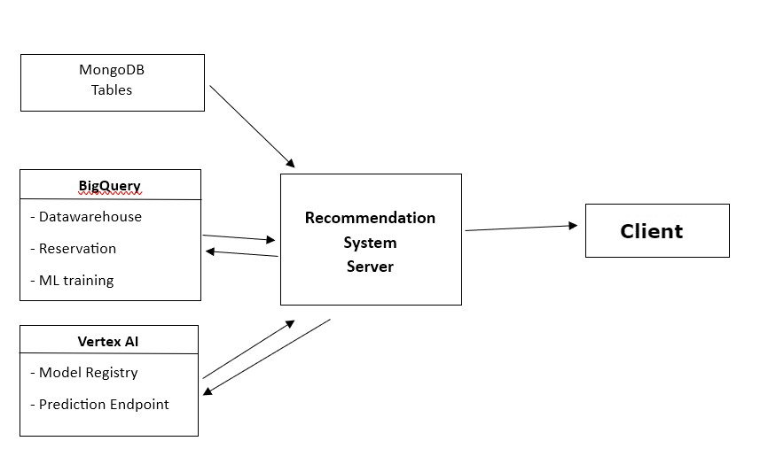

# Recommender System Server: Extraction, Training, Deployment, and Prediction

This server extracts data, trains and deploys a model, and makes predictions using a matrix factorization recommender system.

## ARCHITECTURE SUMMARY

- Data from MongoDB is preprocessed and converted into an interaction matrix, which is then stored in a BigQuery Datawarehouse.
- The interaction matrix is used to train a MATRIX FACTORIZATION model using the Stochastic Gradient Descent (SGD) algorithm.
- The trained model is then transferred to the Vertex AI model registry.
- From the model registry, the model is deployed to a Vertex AI prediction endpoint.
- The prediction endpoint is then used to make recommendations based on the interaction matrix.

## Setup and Installation

### Prerequisites

- Python >= 3.8
- Google Cloud SDK
- MongoDB
- BigQuery

### Google Cloud SDK Authentication

- Local Server

1. Complete the SDK installation and setup
2. Run: `gcloud auth application-default login`

- Remote Server

1. Run: `gcloud auth activate-service-account --key-file=path/to/the/service-account-key.json`
2. Run: `export GOOGLE_APPLICATION_CREDENTIALS="path/to/the/service-account-key.json"`

**Note:** Place the `service-account-key.json` in the root directory. It will be ignored by git.

### Environment Setup

1. Copy the `.env.example` file to `.env` and fill in the required values.
2. Create a Python virtual environment: `python3 -m venv env`
3. Activate the environment: `source env/bin/activate`
4. Install dependencies: `pip install -r requirements.txt`

**Note:** After installing any new dependencies, update the `requirements.txt` file: `pip freeze > requirements.txt`

### Running the Application

To run the application, execute: `python3 main.py`

### Contributing

When contributing to this project, please adhere to the following guidelines:

1. Fork the repository and create a new branch for your feature or bug fix.
2. Write clear, commented code and update documentation as necessary.
3. Submit a pull request with a detailed description of your changes.
